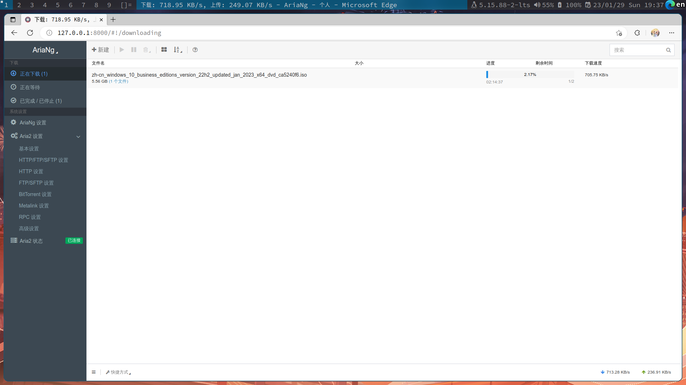

# [English](#EN) | [Chinese](#CN)
# CN
## AriaNg-service
一个小程序来开启、关闭和安装 `mayswind/AriaNg` 的最新release
## 安装
依赖 `jq wget unzip go lsof aria2c`
解决依赖，以archlinux为例
```bash
sudo pacman -S jq wget unzip go lsof aria2c
```
获取源码并编译成可执行二进制文件
```bash
git clone https://github.com/basi-a/AriaNg-service.git
cd AriaNg-service
go mod tidy && go build AriaNg-service.go
```
### 如何食用
```bash
./AriaNg-service help
+--------------------------------------------------------+
+ command  ->  AriaNg-service <option>                   +
+--------------------------------------------------------+
+ help       : show help                                 +
+ start      : start AriaNg                              +
+ stop       : stop AriaNg                               +
+ restart    : restart AriaNg                            +
+ install    : install AriaNg least release              +
+ reinstall  : delate old AriaNg release and install new +
+--------------------------------------------------------+
```
```bash
./AriaNg-service install
./AriaNg-service start
```
如果您有`aria2.conf`, 请修改 `AriaNg-service.go` 中 aria2c 启动参数的配置文件。
在以下位置：
```go
// start aria2c and py_http.server with shell
func start() {
  aria2_start := "aria2c --conf-path=$HOME/.aria2/aria2.conf -D"
  ...
}
```
如果您没有`aria2.conf`，则可以使用 `aria2.conf.example` 创建软连接到 `$HOME/.aria2/aria2.conf`。
示例脚本：
```bash
./use-dotfile.sh
```
另外BT需要更新 `bt-tracker`, 可以按顺序使用以下脚本（ 当配置文件使用的是上面的时 ）:
```bash
./update-tracker.sh
./use-dotfile.sh #Only required if it has not been run
```
***************
# EN
## AriaNg-service
A Mini program to start, stop install the "mayswind/AriaNg" latest release
### install
Rely on `jq wget unzip go lsof aria2c`
Solve dependencies, take archlinux as an example
```bash
sudo pacman -S jq wget unzip go lsof aria2c
```
Obtain the source code and compile it into an executable binary
```bash
git clone https://github.com/basi-a/AriaNg-service.git
cd AriaNg-service
go mod tidy && go build AriaNg-service.go
```

### How to Use
```bash
./AriaNg-service help
+--------------------------------------------------------+
+ command  ->  AriaNg-service <option>                   +
+--------------------------------------------------------+
+ help       : show help                                 +
+ start      : start AriaNg                              +
+ stop       : stop AriaNg                               +
+ restart    : restart AriaNg                            +
+ install    : install AriaNg least release              +
+ reinstall  : delate old AriaNg release and install new +
+--------------------------------------------------------+
```
```bash
./AriaNg-service install
./AriaNg-service start
```
If you have `aria2.conf`, modify the configuration file for the aria2c startup parameters in `AriaNg-service.go`.
In the following locations:
```go
 start aria2c and py_http.server with shell
func start() {
  aria2_start := "aria2c --conf-path=$HOME/.aria2/aria2.conf -D"
  ...
}
```
If you don't have `aria2.conf`, you can use `aria2.conf.example` to create a soft connection to `$HOME/.aria2/aria2.conf`.
Example script:
```bash
./use-dotfile.sh
```
In addition, BT needs to update `bt-tracker`, you can use the following scripts in order (when the configuration file is using the above):
```bash
./update-tracker.sh
./use-dotfile.sh #Only required if it has not been run
```
# ScreenShot

# Thanks all for these 
- [mayswind/AriaNg](https://github.com/mayswind/AriaNg)
- [XIU2/TrackersListCollection](https://github.com/XIU2/TrackersListCollection)

